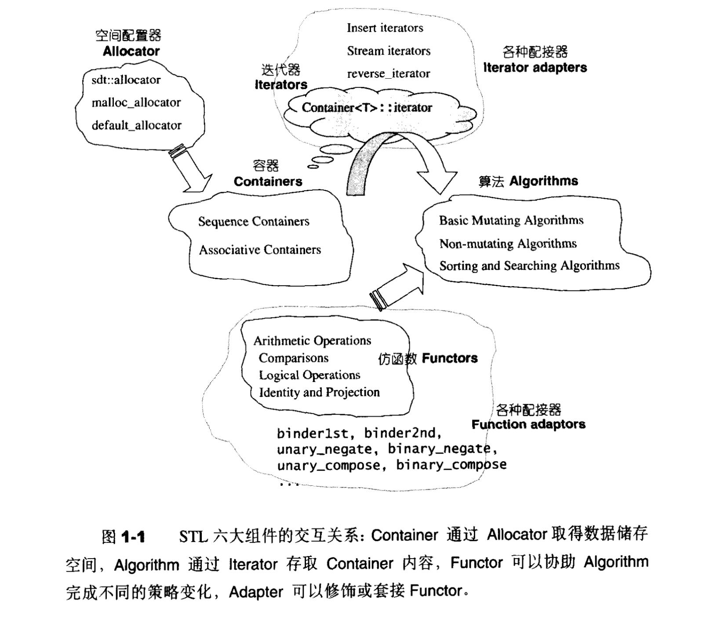
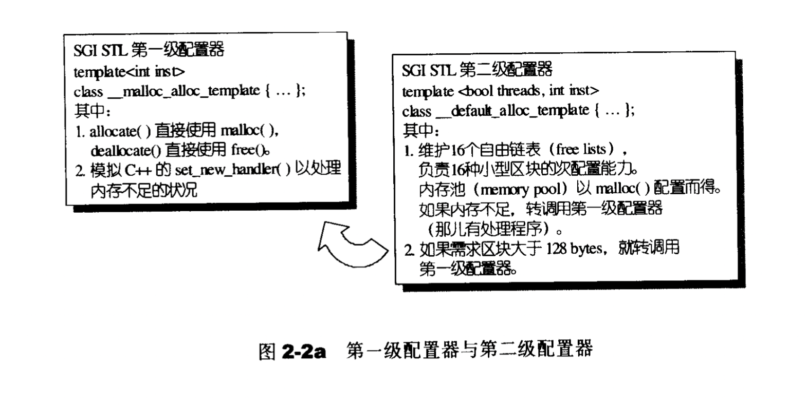
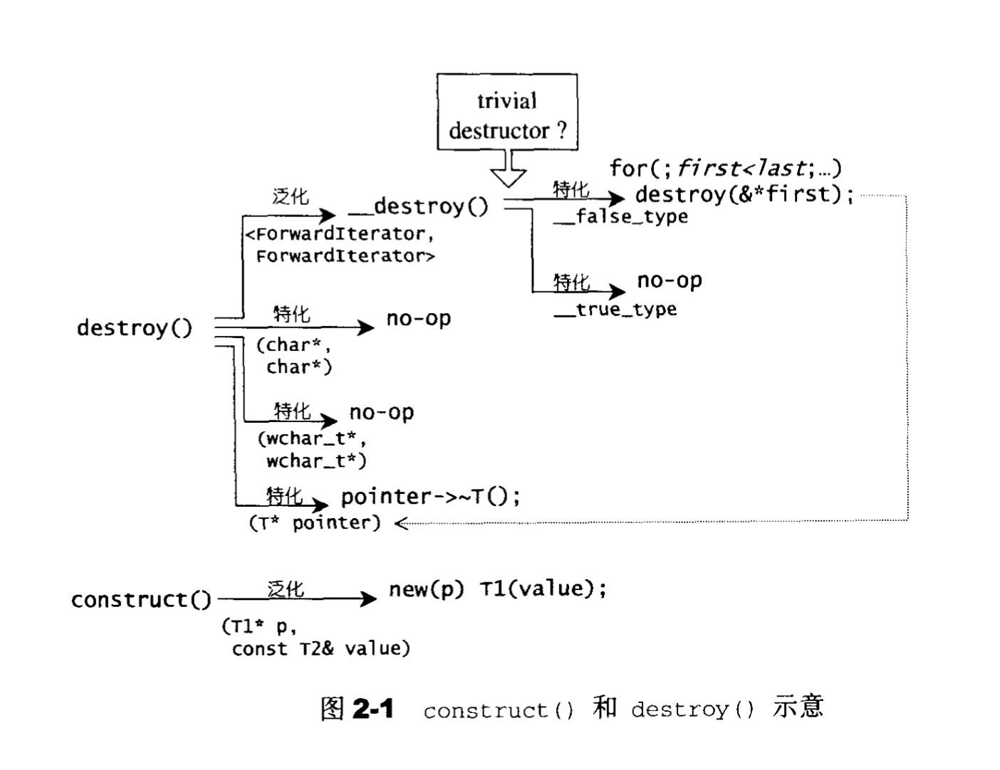
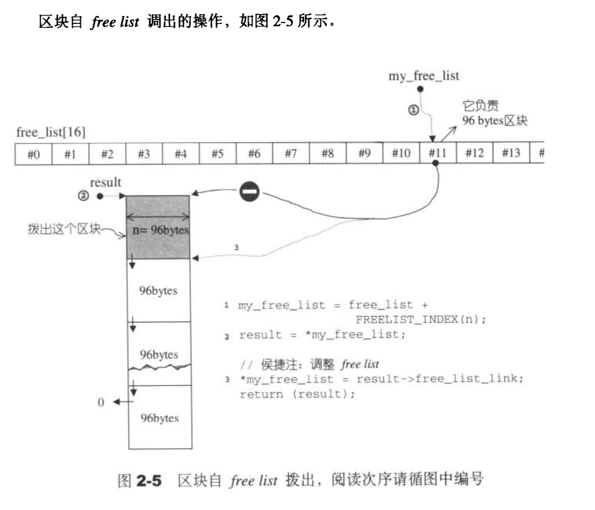
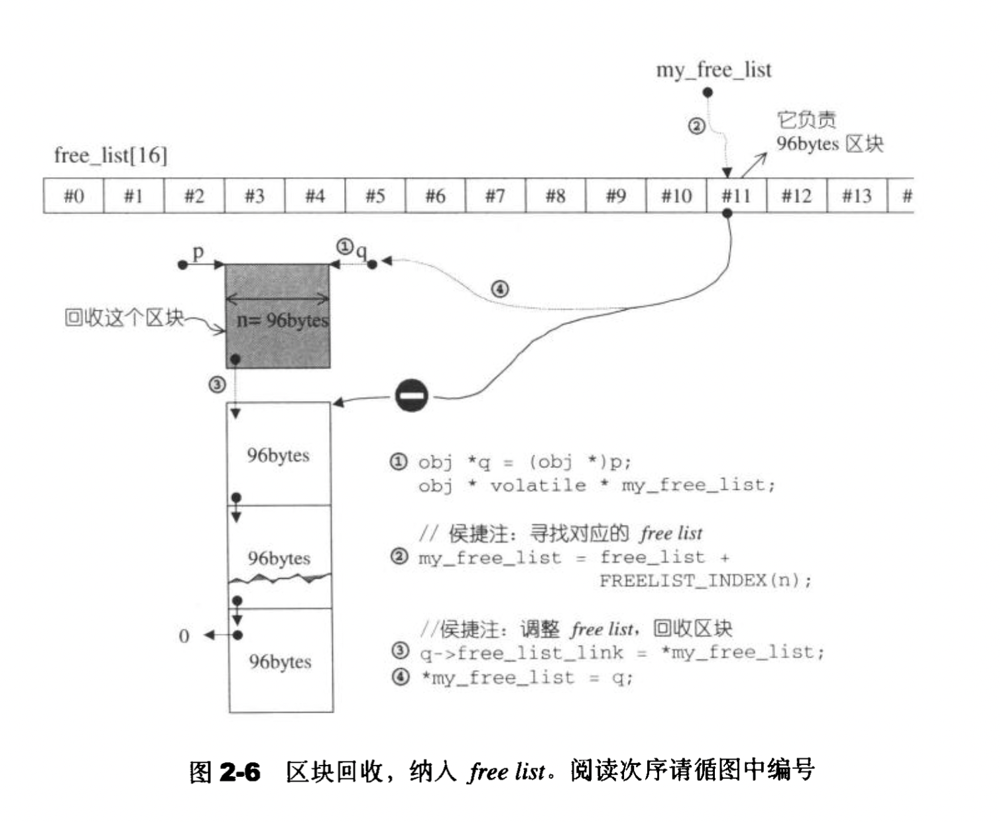
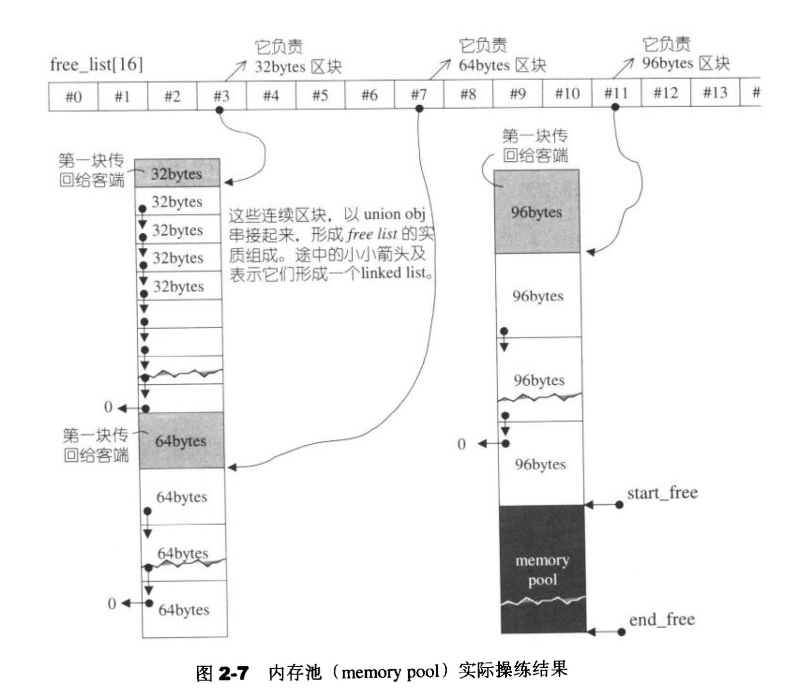
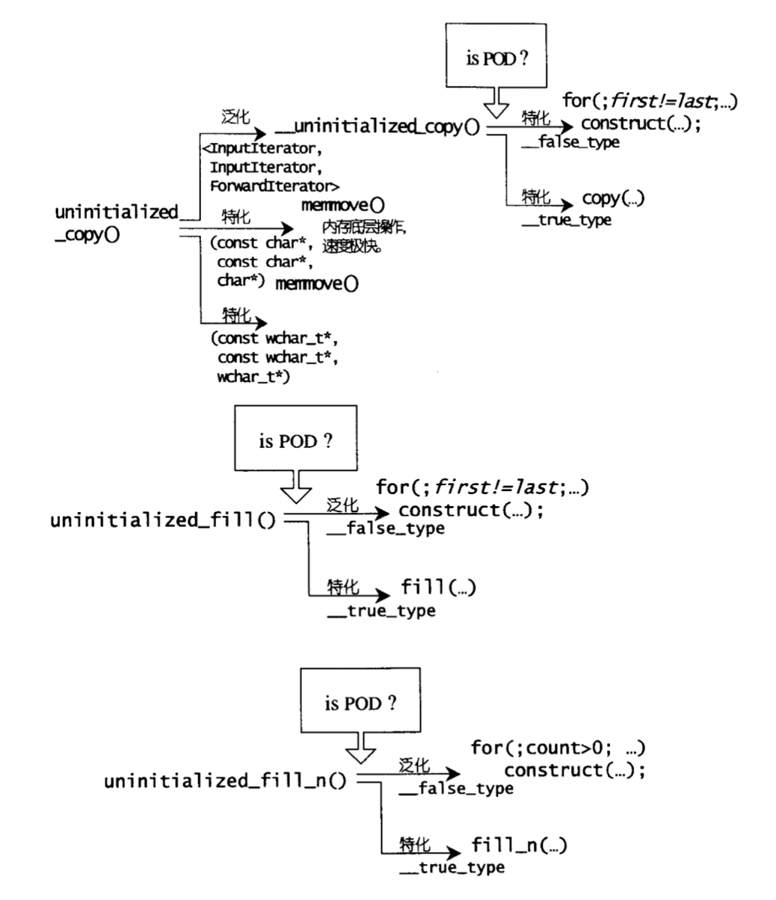
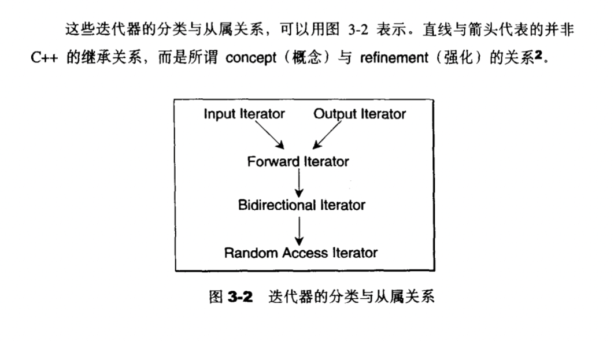
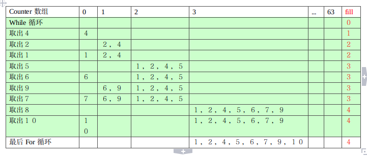

# STL
## 概览
###  STL六大组件
- 容器container: 各种数据结构如vector list等
- 算法algorithm：各种常见算法如sort copy erase等
- 迭代器iterator：扮演容器和算法之间的桥梁，迭代器是一种将operator*，->,++,--等指针操作予以重载的class template，容器都有自己专属的迭代器，原生指针native pointer也是一种迭代器
- 仿函数functor：一种重载了operator()的class或者class template
- 配接器adapter：修饰容器或者仿函数或者迭代器的东西。比如queue和stack虽然看似容器，实际上不过是deque的修饰
- 配置器allotter：负责空间配置和管理的class template

### 组件的关系
- 容器通过配置器来取得数据空间，算法通过迭代器对容器内容进行增删改查，所以说迭代器是算法和容器之间的桥梁（那为什么不直接在容器里面定义算法呢？），仿函数可以协助算法完成不同的策略变化，配接器可以修饰容器或者仿函数或者迭代器。



### STL实现版本
- SGI可读性最好

### 组态
- <stl_config.h>定义了一些常量所有STL头文件都会间接或者直接包含它，让预处理器根据各个常量决定取舍程序代码，便于移植。
- __STL_NULL_TMPL_ARGS 被替换/展开成<>


## 空间配置器allocator
### SGI标准空间配置器std::allocator
- 只是把c++的::operator new/delete薄薄地封装了一下，并未做优化，效率不好，不建议使用
  
### SGI特殊的空间配置器std::alloc
- 内存空间的配置和释放：<stl_alloc.h>
  - 定义第一二级配置器，名为alloc
    
    

- 对象内容的构造和析构：<stl_construct.h>
  - 定义construct 和 destory函数

    

- 大块内存操作: <std_uninitialized.h>

### alloc实现
- 第一级配置器
  - allocate/realloc只是简单地调用malloc/realloc，不成功就调用oom_malloc,内部调用new_alloc_handler制定的内存不足处理例程，如果未定义直接抛出异常，如果定义了则不断尝试分配内存。
    ```
    void *__malloc_alloc::oom_malloc(size_t n) {
        malloc_handler new_alloc_handler;
        void *result;
        for (;;) {  //不断尝试释放、配置
            new_alloc_handler = __malloc_alloc_oom_handler;
            if (!new_alloc_handler) throw std::bad_alloc(); //如果没有设置__malloc_alloc_oom_handler处理方法 直接抛出异常
            (*new_alloc_handler)();  //否则调用handler，试图释放内存
            result = malloc(n);//尝试分配内存
            if (result) return result;
        }
    }

    ```

- 第二级配置器
  - 管理16个free_list，每个free_list指针指向空闲的内存块（对，就是链表组织的内存块），大小8-128，超过128是使用第一级分配器分配内存
  - 链表的每个元素都是union类型的，该类型能够通过共用存储空间来节省链表开销
    - 这一块内存被使用之后next指针的值就被覆盖掉了，反正已经被分配出去了当然不需要next指针了。
    ```
    // free_list节点
    // 由于union特性，并不需要占用额外的内存
    union obj {
        union obj *free_list_link;  //指向下一节点
        char client_data[1];        //指向资源
    };
    ```
  - 维护一块内存池，由start和end指针指明.
  - 当有内存分配请求到达时，先根据大小n找到对应链表，如果有空闲块则分配一块内存即可，如果没有内存，调用refill(ROUND_UP(n))
    - refill在free_list后面接上默认20个空闲块（尽力20个，不足按实际返回，使用chunk_alloc），这些块来自于内存池，拿到chunk后要根据该链表负责的大小将这个内存块串联起来
    - chunk_alloc调用过程中，如果内存池一个内存块都拿不出来
      - 先把内存池的零头编入较小的空闲链表
      - 从堆中malloc一大块空间
        - 如果malloc失败，就到更大的free_list中去找一个空闲的块送到内存池，重新调用chunk_alloc
      - 如果堆中没空间了，空闲链表也没空间了，怎么办？就调用一级配置器看看oom机制能不能尽点力，然后重新调用chunk_alloc，如果它尽不了力那就抛出异常。

- 下图分别是allocate deallocate 和内存池操作
  
  
  


  ### 内存处理工具
  - uninitialized
    - uninitialized_copy
    - uninitialized_fill
    - uninitialized_fill_n
    - 根据isPOD()返回的类型判断调用哪一种函数，平凡的直接赋值，非平凡的需要构造



## 迭代器
### 必要性
- 每个容器都有自己的专属迭代器
- 如果把迭代器与容器分开实现，反而迭代器的实现过程中要暴露很多容器的细节，不如直接将迭代器的实现交给容器的设计者去实现好了。
- 迭代器是算法和容器沟通的桥梁
  - 那么，算法如何通过迭代器知道容器的类型呢？换句话说是求迭代器的value_type
    - 函数模板的参数推导机制 （只能推导函数的参数类型，没办法推导返回值类型）
    - 声明内嵌类型：在类中声明一个类型，函数返回值使用类中的某一个类型声明 （并不是所有的迭代器类型都是class type, 原生指针就不是，但是原生指针可以作为迭代器啊，比如int*是int类型的迭代器，value_type是int。现在给你一个迭代器p,它是int*的，你现在拿到的是p，不知道它的类型，你能返回它的value_type吗？任何原生指针都做不到的。）
    - 更全面的解法：traits 萃取机 + 模板偏特化
- 萃取机应该提供的5种类型
  - value_type
  - difference_type
  - pointer
  - reference
  - iterator_category
```

// traits 展现Iterator所有特性
template <class Iterator>
struct iterator_traits {
    typedef typename Iterator::iterator_category iterator_category;
    typedef typename Iterator::value_type value_type;
    typedef typename Iterator::difference_type difference_type;
    typedef typename Iterator::pointer pointer;
    typedef typename Iterator::reference reference;
};

//针对raw pointer设计的偏特化版本
template <class T>
struct iterator_traits<T *> {
    using iterator_category = random_access_iterator_tag;
    using value_type = T;
    using difference_type = ptrdiff_t;
    using pointer = T *;
    using reference = T &;
};

//针对pointer-to-const设计的偏特化版本
template <class T>
struct iterator_traits<const T *> {
    using iterator_category = random_access_iterator_tag;
    using value_type = T;
    using difference_type = ptrdiff_t;
    using pointer = const T *;
    using reference = const T &;
};
```
### difference_type
- difference_type表示两个迭代器之间的距离的类型，多数应该是ptrdiff_t
```
// count:运用equality判断有几个与value相等的元素
template <class InputIterator, class T>
typename iterator_traits<InputIterator>::difference_type count(
    InputIterator first, InputIterator last, T value) {
    typename iterator_traits<InputIterator>::difference_type count = 0;
    for (; first != last; ++first)
        if (*first == value) count++;
    return count;
}
```
- 任何时候，要想知道迭代器I的difference_type,可以这么写
```
typename iterator_traits<InputIterator>::difference_type
```
### reference type
- 如果需要返回一个左值（迭代器所指向之物允许被改变）
  - 对允许改变所指向之物的迭代器进行取内容操作（提领操作），需要返回一个左值而不是右值，右值不允许被赋值。
  - 比如一个value_type是T，则提领操作*p的类型应该是T&

### pointer type
- 与上面的差不多，就是指针的类型啊

### iterator_category
- 迭代器五种类型
  - Input Iterator: 只读类型
  - Output Iterator： 只写
  - Forward Iterator：允许写入型算法如replace在此种迭代器所形成的区间上进行【读/写】
  - Bidirectional Iterator：可以双向移动
  - Random Access Iterator：可以随机访问，提供指针算术能力
- 迭代器五种类型不是继承关系而是强化关系。但是有时候函数类型名确实取的是最通用最抽象的InputIterator,这里是因为STL算法的命名规则是：以算法能接受的最低阶迭代器类型来为迭代器类型参数命名。


- 算法使用tag来对五种迭代器所对应的操作进行重载
  - 不使用if else是为了在编译期就知道调用哪个函数，提高效率

- 最后五种类型的迭代器的tag还是用了继承，是为了有时候没有声明使用这种tag的函数，它会做向上适应。
### iterator类
- STL提供了一个iterator class，所有新设计的迭代器都要继承它，这样就可以保证符合STL所需要的规范

```
//为了避免遗忘记录traits，此基类以供自定义iterator继承之
template <class Category, class T, class Distance = ptrdiff_t,
          class Pointer = T *, class Reference = T &>
struct iterator {
    typedef Category iterator_category  ;
    typedef T value_type ;
    typedef Distance difference_type  ;
    typedef Pointer pointer;
    typedef Reference reference;
};

```

## vector
### 基本定义
- 线性连续空间

### 迭代器
- 就是原生指针

```c++
template <class T, class Alloc = simpleAlloc<T> >
class vector {
public:  // alias declarartions
    typedef T value_type;
    typedef value_type* pointer;
    typedef value_type* iterator;  // iterator is raw pointer
    typedef const value_type * const_iterator;
    typedef value_type& reference;
    typedef const value_type& const_reference;
    typedef size_t size_type;
    typedef ptrdiff_t difference_type;

...
}

```

### 重要指针
```

private:  // data member
    // iterator to indicate the vector's memory location
    iterator start;//首地址
    iterator finish;//使用的尾地址
    iterator end_of_storage;//实际分配的内存尾地址


```

### 内存管理
- 动态增加大小
  - 不是在原空间之后接续新空间，而是重新配置一大块空间，将原来的连续空间拷贝过来，在插入新的元素
  - 新长度等于旧长度的两倍，或者旧长度+新增元素个数

- 由于是连续内存，对uninitialized系列函数用得比较多，erase，insert等区间操作函数技巧需要掌握

## list
### 基本定义
- 双向链表，离散空间存储
- 节点定义
  ```

  template <class T>
  struct __list_node {
      __list_node *prev;
      __list_node *next;
      T data;
  };
  ```

### 迭代器
- 主要是要解决离散空间的问题
```
template <class T>
struct __list_iterator {
    // alias declarations
    using self = __list_iterator<T>;
    using link_type = __list_node<T> *;

    using iterator_category = bidirectional_iterator_tag;
    using value_type = T;
    using pointer = T *;
    using reference = T &;

    using difference_type = ptrdiff_t;

    // data member
    link_type node;  // raw pointer link to list_node

    // ctor
    __list_iterator() {}
    explicit __list_iterator(link_type x) : node(x) {}

    // dtor(trivial)

    bool operator==(const self &rhs) const noexcept { return node == rhs.node; }
    bool operator!=(const self &rhs) const noexcept { return node != rhs.node; }

    // dererence
    reference operator*() const { return node->data; }

    // member access
    pointer operator->() const { return &(operator*()); }

    // increasement
    self &operator++() {
        node = node->next;
        return *this;
    }

    self operator++(int i) {
        self temp = *this;
        ++(*this);
        return temp;
    }

    // decreasement
    self &operator--() {
        node = node->prev;
        return *this;
    }

    self operator--(int i) {
        self temp = *this;
        --(*this);
        return temp;
    }
};

template <class T>
struct __list_const_iterator {
    // alias declarations
    using iterator = __list_iterator<T>;
    using self = __list_const_iterator<T>;
    using link_type = __list_node<T> *;

    using iterator_category = bidirectional_iterator_tag;
    using value_type = T;
    using pointer = const T *;
    using reference = const T &;
    using difference_type = ptrdiff_t;

    // data member
    link_type node;  // raw pointer link to list_node

    // ctor
    __list_const_iterator() {}
    explicit __list_const_iterator(link_type x) : node(x) {}
    __list_const_iterator(const iterator &x) : node(x.node) {}

    // dtor(trivial)

    bool operator==(const self &rhs) const noexcept { return node == rhs.node; }
    bool operator!=(const self &rhs) const noexcept { return node != rhs.node; }

    // dererence
    reference operator*() const { return node->data; }

    // member access
    pointer operator->() const { return &(operator*()); }

    // increasement
    self &operator++() {
        node = node->next;
        return *this;
    }

    self operator++(int i) {
        self temp = *this;
        ++(*this);
        return temp;
    }

    // decreasement
    self &operator--() {
        node = node->prev;
        return *this;
    }

    self operator--(int i) {
        self temp = *this;
        --(*this);
        return temp;
    }
};

}  // namespace MiniSTL


```


### list数据结构
- 整体是一个环状双向链表
- 只要持有一个__list_node指针，加上begin和end方法，便可以表示整个链表

```

template <class T, class Alloc = simpleAlloc<T>>
class list {
public:  // alias declarations
    using value_type = T;
    using pointer = value_type *;
    using const_pointer = const value_type *;
    using reference = value_type &;
    using const_reference = const value_type &;
    using size_type = size_t;
    using difference_type = ptrdiff_t;

    using iterator = __list_iterator<T>;
    using const_iterator = __list_const_iterator<T>;
    using reverse_iterator = MiniSTL::__reverse_iterator<iterator>;
    using const_reverse_iterator = MiniSTL::__reverse_iterator<const_iterator>;

private:  // interface about allocate/deallocate litsNode
    using list_node = __list_node<T>;
    using list_node_allocator = simpleAlloc<list_node>;
    // only data member(tail)
    list_node *node; //链表指针 只要有它就可以找到整个环
    ...

}
```

### 重要方法
- transfer:将[first, last)内所有元素迁移到position之前，并接上原先断开的区间
- splice merge reverse等都可以借助transfer
- sort方法
  - 比较特殊，不能直接使用算法模块里的sort，因为那个sort只能接受随机迭代器
  - 链表排序一般使用归并排序，SGI使用的是一种桶+迭代式归并排序
  - 具体步骤
    - 总体上来说，算法的思想就是准备64个槽(counter[i])，编号为0,1,...,63,分别表示已经排序长为1,2,4,8,16,...的链表．一开始这64个槽为空.

    - 1. 如果待排序链表还有未被取出的元素则取出下一个元素，否则转到3
    - 2. 将这个元素先和0号槽合并，如果此时0号槽为空则，将合并后结果放入0号槽;
    - 3. 如果不为空那么合并后长度变为2,则清空0号槽，继续和1号槽合并，依次类推一直合并到i号槽，且i号槽为空，则将合并结果放入i号槽．转到1.
将这64个槽从低到高依次合并，得到最终的结果.

  